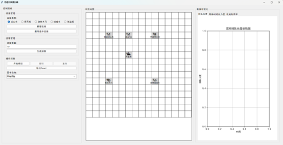
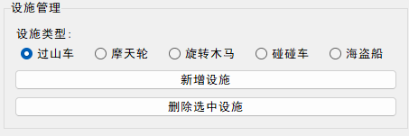
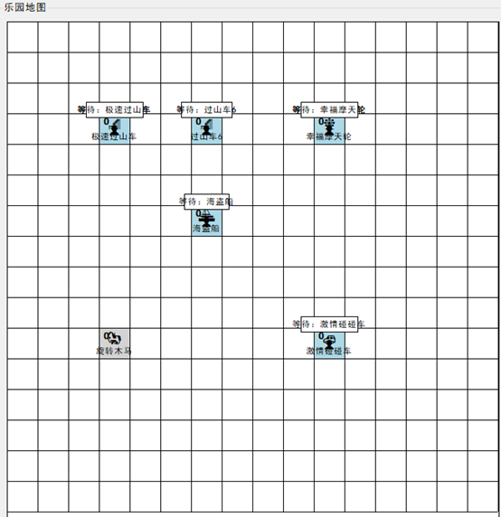
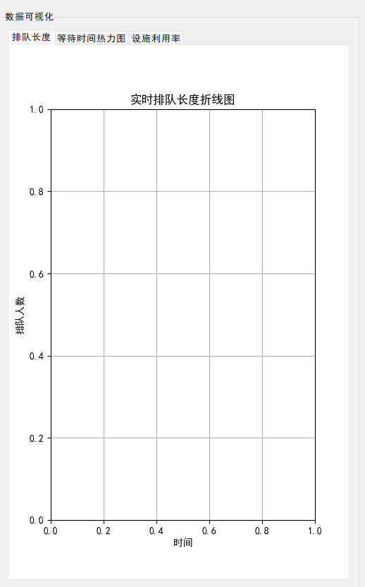

```markdown
# 奇趣乐园模拟器
[](https://www.python.org/)
[](LICENSE)
[](test_simulation.py)
[](requirements.txt)

## 项目简介
奇趣乐园模拟器是一款 **可视化乐园运营模拟工具**，专为乐园运营者、学生及模拟爱好者设计。通过 16×16 网格地图、实时数据图表、游客行为模拟，直观展示设施排队情况、利用率等核心指标，支持动态调整设施参数（容量、运行时长等），辅助运营决策优化（如设施布局调整、客流疏导），兼具实用性与教学价值。

## 项目截图（无渲染直接显示）
| 主界面概览 | 设施管理操作 |
|------------|--------------|
|  |  |
| 游客行为模拟 | 数据可视化图表 |
|  |  |

> 📌 图片说明：所有截图均为程序实际运行效果，GitHub 可直接渲染显示（无需额外插件），建议保持图片尺寸统一（主界面1400×800，功能模块800×500）。

## 核心技术栈
- **前端/GUI**：Pygame（地图渲染、交互控制）、Tkinter（控制面板、图表容器）
- **数据可视化**：Matplotlib（折线图、热力图、仪表盘）
- **数据处理**：Pandas（数据存储、Excel导出）、Numpy（数值计算）
- **核心数据结构**：队列（排队逻辑）、栈（行程单、撤销/重做）
- **工具类**：Openpyxl（Excel写入）、JSON（布局配置存储）

## 功能特性
### 核心功能 🚀
- 🗺️ **16×16 网格地图**：用 emoji 区分设施类型（🎢 过山车、🎡 摩天轮等），直观展示设施位置与状态
- 🏟️ **设施动态管理**：支持新增/删除设施，自定义名称、容量、单次运行时长，拖拽调整位置（自动避开已占用格子）
- 📊 **实时状态监控**：设施排队人数（>10人红色提醒）、运行/空闲状态、总服务游客数实时更新
- 👥 **游客行程模拟**：基于栈结构实现游客行程单，按预设计划移动、排队、游玩，头顶气泡显示实时状态（如“下一站：摩天轮”）
- 📈 **多维度数据可视化**：
  - 排队长度折线图：跟踪各设施排队人数变化
  - 等待时间热力图：按时间段展示不同设施的平均等待时间
  - 设施利用率仪表盘：用红（<50%）、黄（50%-80%）、绿（>80%）区分利用率等级

### 进阶功能 ⭐
- 🔄 **操作撤销/重做**：支持最多 5 步操作回滚（新增、删除、移动设施）
- 📥 **数据导出**：模拟数据导出为 Excel，包含设施基础信息、实时排队数据、利用率历史
- 🔧 **布局自动保存**：设施位置变更后自动写入 `layout.json`，下次启动自动加载
- 👨👩👧👦 **批量游客生成**：自定义游客数量，在乐园入口批量生成，支持 50+ 游客同时模拟

## 快速开始
### 1. 环境要求
- 操作系统：Windows/macOS/Linux
- Python 版本：3.10 及以上
- 依赖库：matplotlib、numpy、pandas、openpyxl、pygame

### 2. 安装步骤
```bash
# 1. 克隆仓库
git clone https://github.com/daodiaoren-tlh/-.git

# 2. 进入项目目录
cd theme-park-simulator

# 3. 安装依赖
pip install -r requirements.txt
```

### 3. 启动程序
```bash
python main.py
```
> 📌 首次启动说明：  
> - 自动创建 5 个默认设施（极速过山车、幸福摩天轮、旋转木马、激情碰碰车、海盗船）  
> - 设施布局保存在 `layout.json`，后续修改会实时更新该文件  

## 操作指南
### 1. 设施管理（对应截图：设施管理操作）
1. **新增设施**：
   - 在左侧「控制面板」→「设施管理」中选择设施类型（如“过山车”）
   - 点击「新增设施」，在弹窗中设置：
     - 设施名称（默认如“过山车6”，需唯一）
     - 容量（单次可容纳人数，默认值按设施类型预设）
     - 运行时长（单次运行秒数，默认值按设施类型预设）
   - 点击「确定」，设施会在地图空白格子生成
2. **删除设施**：
   - 点击「删除选中设施」，若仅1个设施则直接删除；若多个设施，输入目标设施名称即可
3. **调整位置**：
   - 鼠标点击地图上的设施，按住拖拽到空白格子，松开后自动保存新位置

### 2. 游客管理（对应截图：游客行为模拟）
1. 在左侧「控制面板」→「游客管理」中输入游客数量（需≥1）
2. 点击「生成游客」，游客会在地图左上角（入口位置）生成
3. 游客行为逻辑：
   - 按行程单顺序前往目标设施，移动过程中状态为“自由”
   - 到达设施后进入排队，状态变为“等待”
   - 设施启动运行后，游客进入“游玩”状态
   - 游玩结束后，更新行程单，前往下一个目标（无目标则状态变为“行程结束”）

### 3. 数据可视化（对应截图：数据可视化图表）
1. 在左侧「控制面板」→「操作控制」中，通过「图表设施」下拉框选择查看目标（“所有设施”或单个设施）
2. 右侧「数据可视化」标签页切换：
   - 「排队长度」：折线图展示实时排队人数变化（x轴为模拟时间，格式“分:秒”）
   - 「等待时间热力图」：按“0-10分钟”等时间段展示各设施平均等待时间
   - 「设施利用率」：卡片式展示各设施当前利用率，颜色区分等级

## 文件结构
```
theme-park-simulator/
├─ main.py                # 程序入口，初始化Tkinter根窗口并启动GUI
├─ gui.py                 # 核心GUI逻辑：地图绘制、图表渲染、按钮事件绑定
├─ facility.py            # 设施类+工厂模式：Facility（设施逻辑）、FacilityFactory（创建设施）
├─ visitor.py             # 游客类+生成器：Visitor（游客行为）、VisitorGenerator（批量生成）
├─ data_structures.py     # 数据结构工具：队列（排队）、栈（行程单）、命令栈（撤销/重做）
├─ utils.py               # 通用工具：Excel导出、JSON读写、位置计算、颜色配置
├─ test_simulation.py     # 单元测试：数据结构、设施逻辑、游客行程等核心功能测试
├─ layout.json            # 设施布局配置：自动保存设施名称、坐标、参数等信息
├─ requirements.txt       # 依赖库列表：matplotlib==3.8.0、numpy==1.26.0等
├─ README.md              # 项目说明文档（当前文件）
└─ screenshots/           # 演示图片目录：存放4张核心截图（必须包含）
   ├─ main_interface.png  # 主界面全景截图
   ├─ facility_management.png  # 设施管理操作截图
   ├─ visitor_simulation.png    # 游客行为模拟截图
   └─ data_visualization.png    # 数据可视化图表截图
```

## 测试说明
```bash
# 运行单元测试（验证核心功能可用性）
python test_simulation.py
```
- 测试覆盖范围：数据结构正确性、设施排队逻辑、游客行程算法、Excel导出功能
- 测试结果：所有用例通过则输出“All tests passed!”，失败会标注具体模块

## 常见问题（FAQ）
1. **Q：启动报错“ModuleNotFoundError: No module named 'xxx'”？**  
   A：未安装依赖库，执行 `pip install -r requirements.txt` 即可（确保Python版本≥3.10）。

2. **Q：新增设施时弹窗提示“设施名称已存在”？**  
   A：设施名称需唯一，修改名称后重试（如将“过山车6”改为“极速过山车2”）。

3. **Q：拖拽设施时无法移动到目标格子？**  
   A：目标格子已被其他设施占用，选择空白格子即可。

4. **Q：Excel导出失败或文件无法打开？**  
   A：检查2点：① 确保至少有1个设施（无设施则无数据可导出）；② 升级openpyxl：`pip install --upgrade openpyxl`。

5. **Q：模拟运行时地图刷新卡顿？**  
   A：减少同时模拟的游客数量（建议≤50人），或关闭其他占用资源的程序。

## 贡献指南
欢迎参与项目优化，贡献流程如下：
1. **Fork 仓库**：点击 GitHub 仓库右上角「Fork」按钮，创建个人分支
2. **创建开发分支**：
   ```bash
   git checkout -b feature/新增功能名称  # 如 feature/新增游客满意度指标
   # 或 bugfix/修复问题描述  # 如 bugfix/修复设施利用率计算错误
   ```
3. **提交代码**：
   - 遵循代码风格：变量名用小写+下划线（如 `queue_length`），函数名用动词开头（如 `start_run`）
   - Commit 信息格式：`[类型] 描述`（如 `[Feature] 新增游客满意度计算`）
   ```bash
   git add .
   git commit -m "[Feature] 新增游客满意度计算"
   git push origin 分支名称
   ```
4. **提交 Pull Request**：在 GitHub 个人分支页面点击「Compare & pull request」，说明修改内容，等待审核

## 许可证
本项目采用 **MIT 许可证** 开源，允许：
- 商用、修改、分发本项目代码
- 基于本项目进行二次开发
- 需在衍生作品中保留原作者版权声明（本 README.md 中的团队信息）
